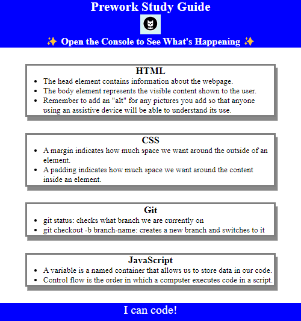

# Prework Study Guide

## Description

This guide was created as a means to help others as the navigate through the coding bootcamp course.  In theory, it should remove some stress and create a sense of direction throughout the class.  As I've worked through creating this, I've learned how to work within HTML, CSS and Java code.  Lastly (but far from least!), I've gained some cross-code required knowledge of git and how to use it as a code repository and versioning control solution!

## Table of Contents

- [Installation](#installation)
- [Usage](#usage)
- [Credits](#credits)
- [License](#license)

## Installation

N/A

## Usage

This guide can be used as a solution for note keeping and sharing.  It will not only be useful in it's ability to provide information, but will also allow users to hone their coding and git skills while using it.

## Credits

Here are all the websites/walkthroughs I've referenced in order to produce this site:

### CSS Information

### CSSBox Information

### Git Cheat Sheet (pdf)

### Git Flow Process

### HTML Reference

### Java Basics

### Java Data Types

## License

The last section of a high-quality README file is the license. This lets other developers know what they can and cannot do with your project. If you need help choosing a license, refer to [https://choosealicense.com/](https://choosealicense.com/).

---

🏆 The previous sections are the bare minimum, and your project will ultimately determine the content of this document. You might also want to consider adding the following sections.

## Badges

Badges aren't necessary, but they demonstrate street cred. Badges let other developers know that you know what you're doing. Check out the badges hosted by [shields.io](https://shields.io/). You may not understand what they all represent now, but you will in time.

## Features

If your project has a lot of features, list them here.

## How to Contribute

If you created an application or package and would like other developers to contribute to it, you can include guidelines for how to do so. The [Contributor Covenant](https://www.contributor-covenant.org/) is an industry standard, but you can always write your own if you'd prefer.

## Tests

Go the extra mile and write tests for your application. Then provide examples on how to run them here.